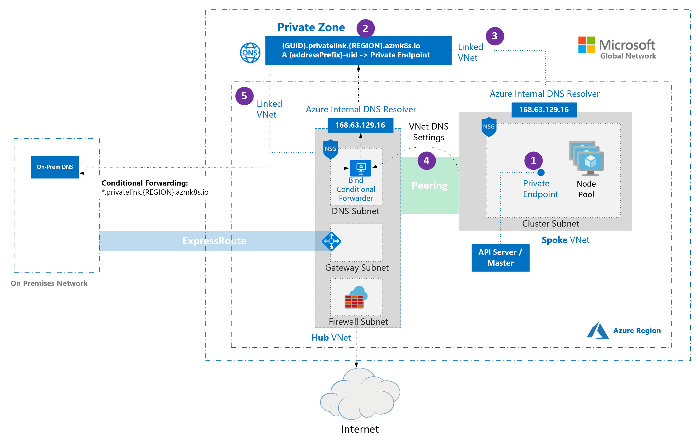
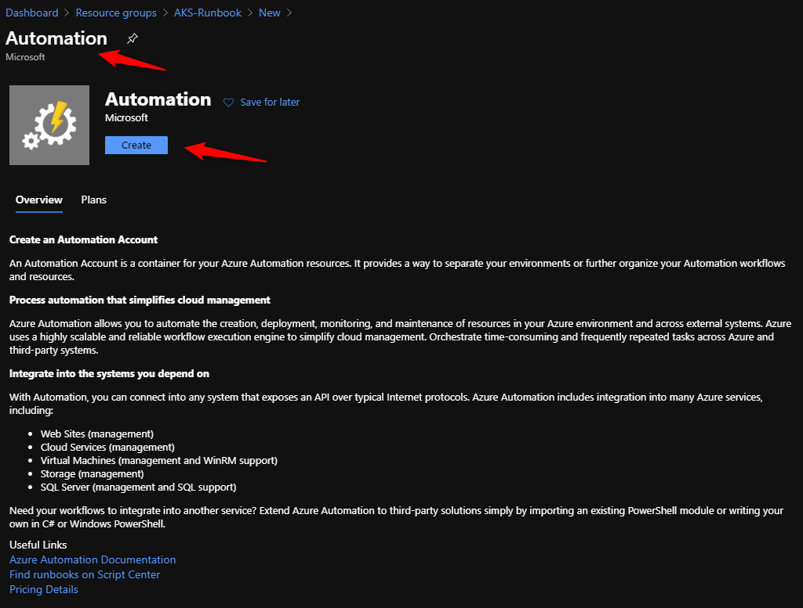
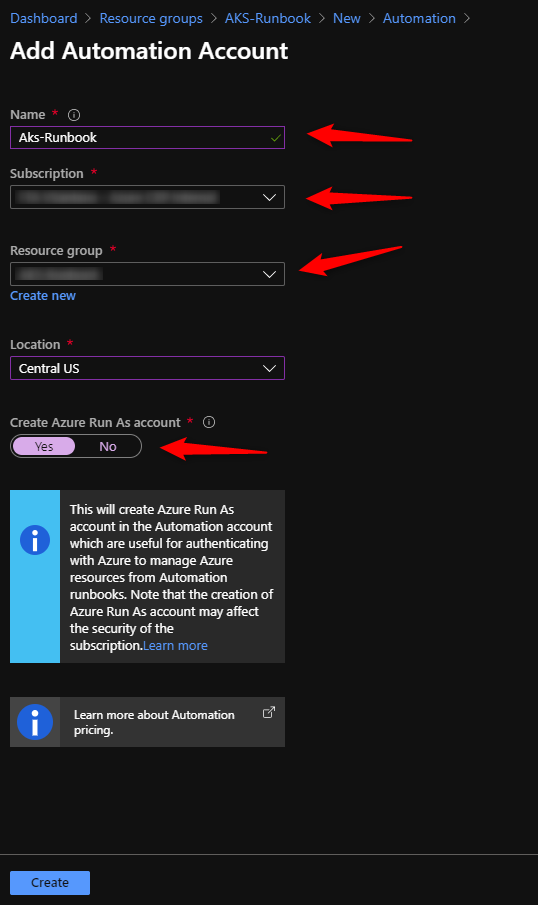

Deploying private Azure Kubernetes Service cluster in Hub and spoke scenario with custom DNS
=====================================================================================

Table of Contents
=================

## 1. Introduction

[Hub and spoke architectures](https://docs.microsoft.com/azure/architecture/reference-architectures/hybrid-networking/hub-spoke) are commonly used to deploy networks in Azure. In many of these deployments, DNS settings in the spoke VNets are configured to reference a central DNS forwarder to allow for on-premises and Azure-based DNS resolution. When deploying an AKS cluster into such a networking environment, there are some special considerations that must be taken into account.

1. By default, when a private cluster is provisioned, a private endpoint (1) and a private DNS zone (2) are created in the cluster managed resource group. The cluster uses an A record in the private zone to resolve the IP of the private endpoint for communication to the API server.

2. The private DNS zone is linked only to the VNet that the cluster nodes are attached to (3). This means that the private endpoint can only be resolved by hosts in that linked VNet. In scenarios where no custom DNS is configured on the VNet (default), this works without issue as hosts point at 168.63.129.16 for DNS which can resolve records in the private DNS zone due to the link.

3. In scenarios where the VNet containing your cluster has custom DNS settings (4), cluster deployment fails unless the private DNS zone is linked to the VNet that contains the custom DNS resolvers (5). This link can be created manually after the private zone is created during cluster provisioning or via automation upon detection of creation of the zone using event-based deployment mechanisms (for example, Azure Event Grid and Azure Functions).

Reference:

Hub and spoke with custom DNS - https://docs.microsoft.com/en-us/azure/aks/private-clusters#hub-and-spoke-with-custom-dns

## 2. How to deploy AKS Private cluster in Hub and spoke scenario with custom DNS

Deploying AKS Private cluster in Hub and spoke scenario with custom DNS needs the following resources to be created:

- Azure Automation Account
    - Runbook with Run as account
- Azure Monitor
    - Action Group
    - Alert Rule

During the creation of a AKS Private cluster a Private DNS Zone will be created. This Private DNS Zone must be linked to the HUB VNet before the AKS Cluster deployment has finished to allow the custom DNS Server to resolve names under this Private DNS Zone.

In this process Azure Monitor will log an alert for the new new Private DNS Zone and will trigger a Runbook to create a "Private DNS Virtual network link" to the HUB VNet.

### Creating Azure Automation Account

1. In the [portal](https://portal.azure.com), Click the **Create a resource** button found in the upper left corner of Azure portal.

2. Select **IT & Management Tools**, and then select **Automation**. You can also search for Automation Accounts and create.

3. Enter the account information, including the selected account name. For **Create Azure Run As account**, choose **Yes** so that the artifacts to simplify authentication to Azure are enabled automatically. When the information is complete, click **Create** to start the Automation account deployment.

4. When the deployment has completed, click **All Services**.