Deploying private Azure Kubernetes Service cluster in Hub and spoke scenario with custom DNS
=====================================================================================

Table of Contents
=================

## 1. Introduction

[Hub and spoke architectures](https://docs.microsoft.com/azure/architecture/reference-architectures/hybrid-networking/hub-spoke) are commonly used to deploy networks in Azure. In many of these deployments, DNS settings in the spoke VNets are configured to reference a central DNS forwarder to allow for on-premises and Azure-based DNS resolution. When deploying a private AKS cluster into such a networking environment, there are some special considerations that must be taken into account.

1. By default, when a private cluster is provisioned, a private endpoint (1) and a private DNS zone (2) are created in the cluster managed resource group. The cluster uses an A record in the private zone to resolve the IP of the private endpoint for communication to the API server.

2. The private DNS zone is linked only to the VNet that the cluster nodes are attached to (3). This means that the private endpoint can only be resolved by hosts in that linked VNet. In scenarios where no custom DNS is configured on the VNet (default), this works without issue as hosts point at 168.63.129.16 for DNS which can resolve records in the private DNS zone due to the link.

3. In scenarios where the VNet containing your cluster has custom DNS settings (4), cluster deployment fails unless the private DNS zone is linked to the VNet that contains the custom DNS resolvers (5). This link can be created manually after the private zone is created during cluster provisioning or via automation upon detection of creation of the zone using event-based deployment mechanisms (for example, Azure Event Grid and Azure Functions).

Reference:

Hub and spoke with custom DNS - https://docs.microsoft.com/en-us/azure/aks/private-clusters#hub-and-spoke-with-custom-dns

This article will discuss option (3); more specifically it will focus on how to automate the creation of the link between the Hub VNET and the PrivateDNS Zone when deploying a private AKS cluster using Azure Monitor Alerts and Automation Runbooks

## 2. Automating the creation of the link between the hub VNET and the PrivateDNS Zone

In order to automate the creation of the link between the Hub VNET and the PrivateDNS Zone we need to create the following resources before creating the Private AKS Cluster:

- Azure Automation Account
    - Runbook with Run as account
- Azure Monitor
    - Action Group
    - Alert Rule

In this process Azure Monitor will log an alert for the new new Private DNS Zone and will trigger a Runbook to create a "Private DNS Virtual network link" to the HUB VNet.

### Creating Azure Automation Account

1. In the [portal](https://portal.azure.com), Click the **Create a resource** button found in the upper left corner of Azure portal.

2. Select **IT & Management Tools**, and then select **Automation**. You can also search for "Automation Accounts" and create it from there.

    

3. Enter the account information, including the selected account name. For **Create Azure Run As account**, choose **Yes** so that the artifacts to simplify authentication to Azure are enabled automatically. When the information is complete, click **Create** to start the Automation account deployment.

    

4. When the deployment has completed, click **All Services**.

5. Select **Automation Accounts** and then choose the Automation account you've created.

### Importing Azure PowerShell Modules

The Runbook requires two Azure PowerShell modules:
- Az.Accounts
- Az.PrivateDns

Import the PowerShell modules from Modules gallery.

1. In the Azure portal, from your Automation account.

2. Select Modules gallary.

3. Search for Az.Account.

    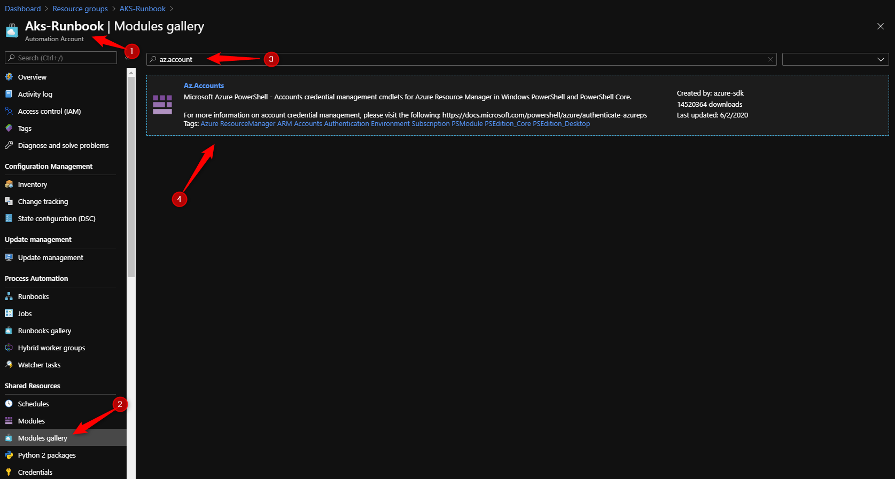

4. Import Az.Account module.

    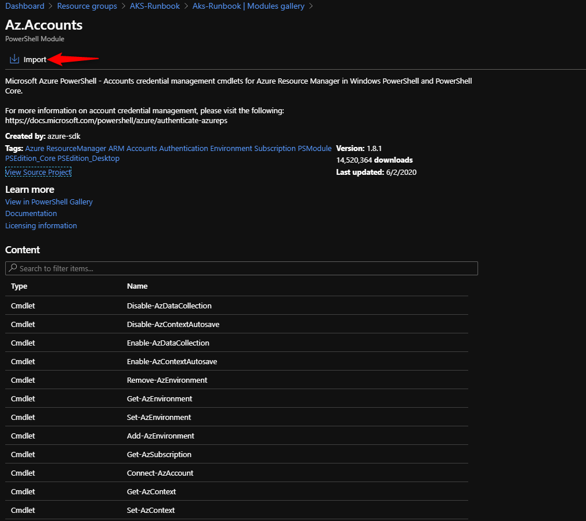

5. Wait until the module has been imported.

    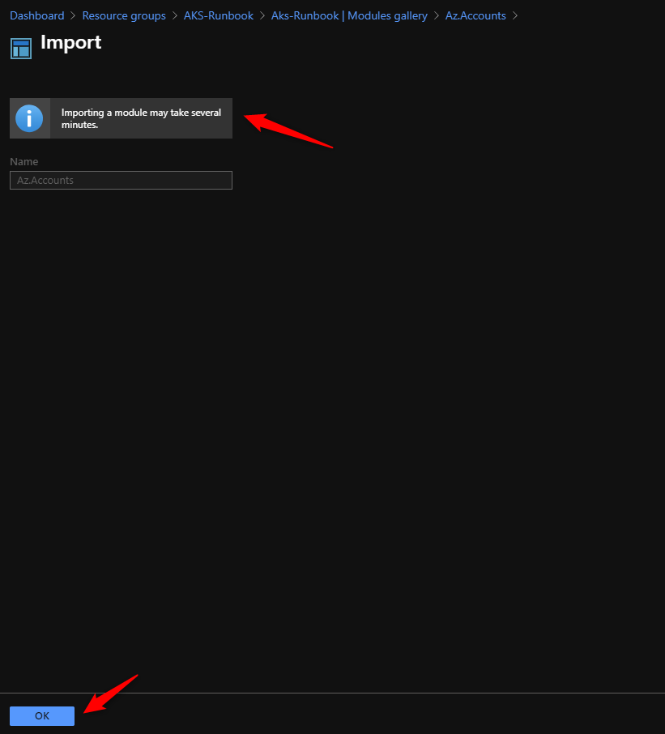

6. You can track the progress selecting Modules

    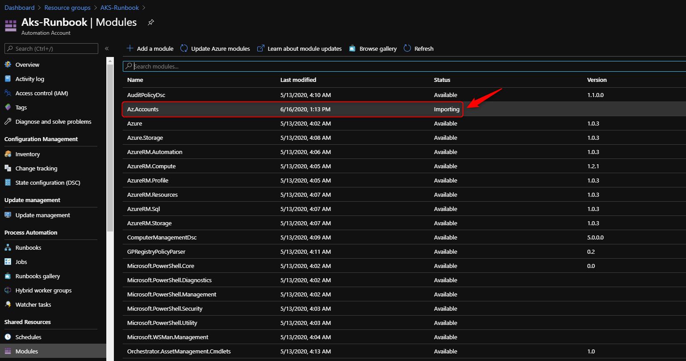

7. Import Az.PrivateDns module.

8. Search for Az.PrivateDns.

    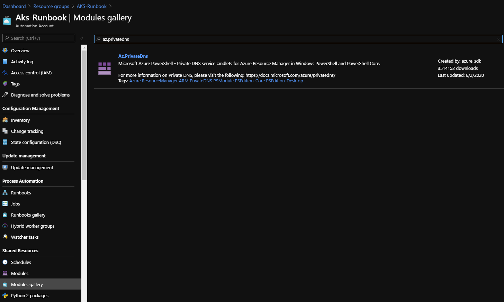

9. Import Az.PrivateDns module.

    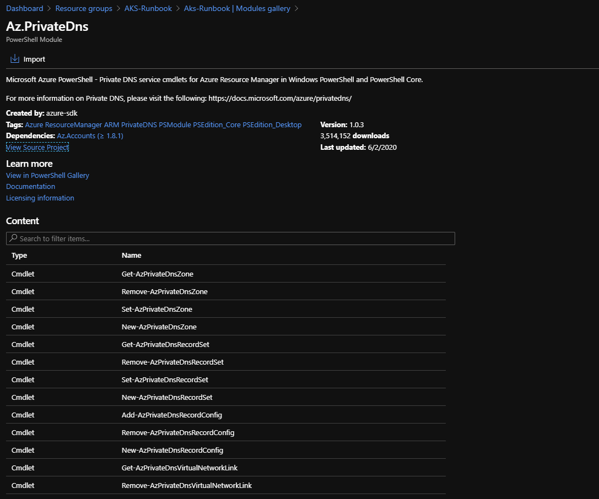

10. Wait until the module has been imported.

### Create Runbook

1. In the Azure portal, from your Automation account.

2. Select **Runbooks** under **Process Automation** to open the list of runbooks.

3. Click **Create a runbook**.

    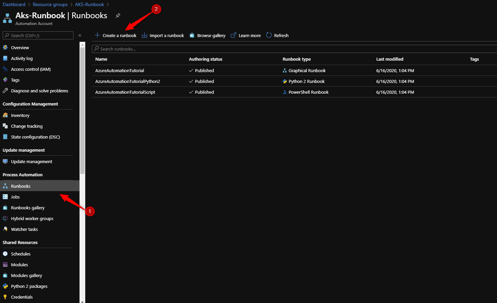

4. Type a Name and select a **Runbook type PowerShell** and Create.

    

5. Copy and paste the PowerShell script [CreateAKSPrivateDNSZoneLink](CreateAKSPrivateDNSZoneLink.ps1) into the Runbook.

6. Replace $HubVNetID with the VNet resource Id where the "Private DNS Virtual network link" must be created.

7. Save and Publish the Runbook.

    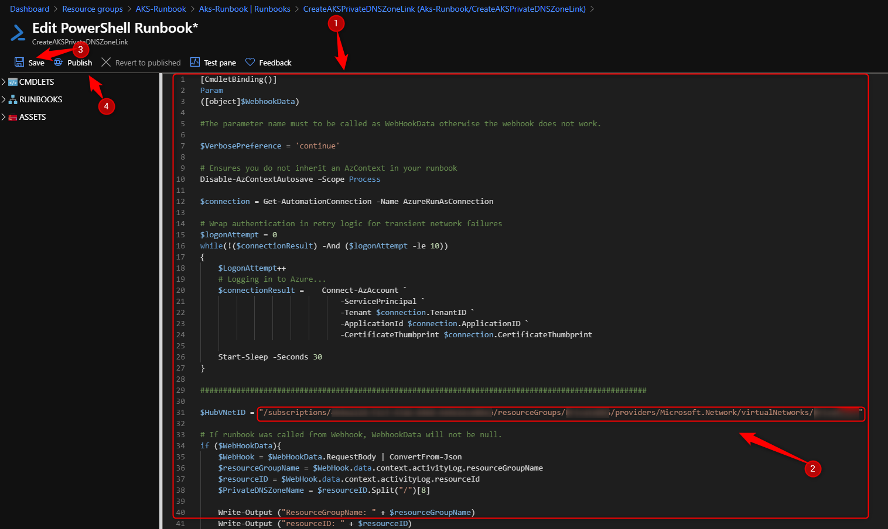

### Create Monitor Alert

Create a new Alert rule to trigger the Runbook everytime a new Private Dns zone is created from Azure Kubernetes Service.

1. In the [portal](https://portal.azure.com/), select **Monitor**. In that section, choose **Alerts**.

2. Click **New Alert Rule**. 

    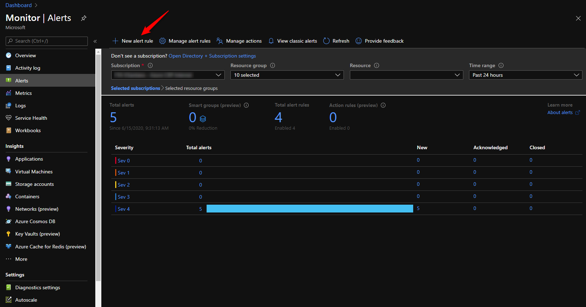

3. The **Create Alert** pane appears. It has four parts: 
    - The resource to which the alert applies
    - The condition to check
    - The action to take if the condition is true
    - The details to name and describe the alert. 

4. Define the alert condition by using the **Select Resource**.

    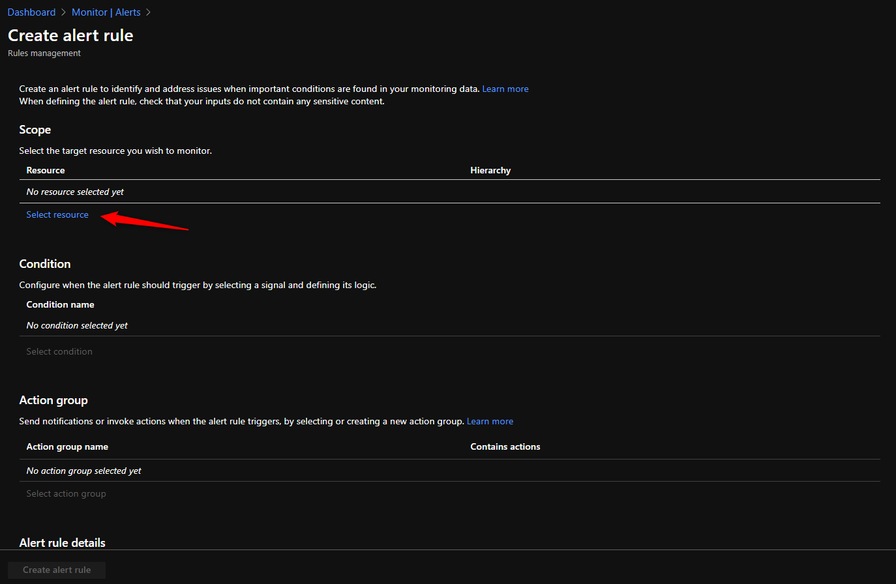

5. Filter by choosing the **Subscription**, **Resource Type**, and required **Resource**.
    - **Filter by subscription**: Select the subscription to be monitored.
    - **Filter by resource type**: Select **Private DNS zones**.
    - **Resource**: Click in your subscription name.

    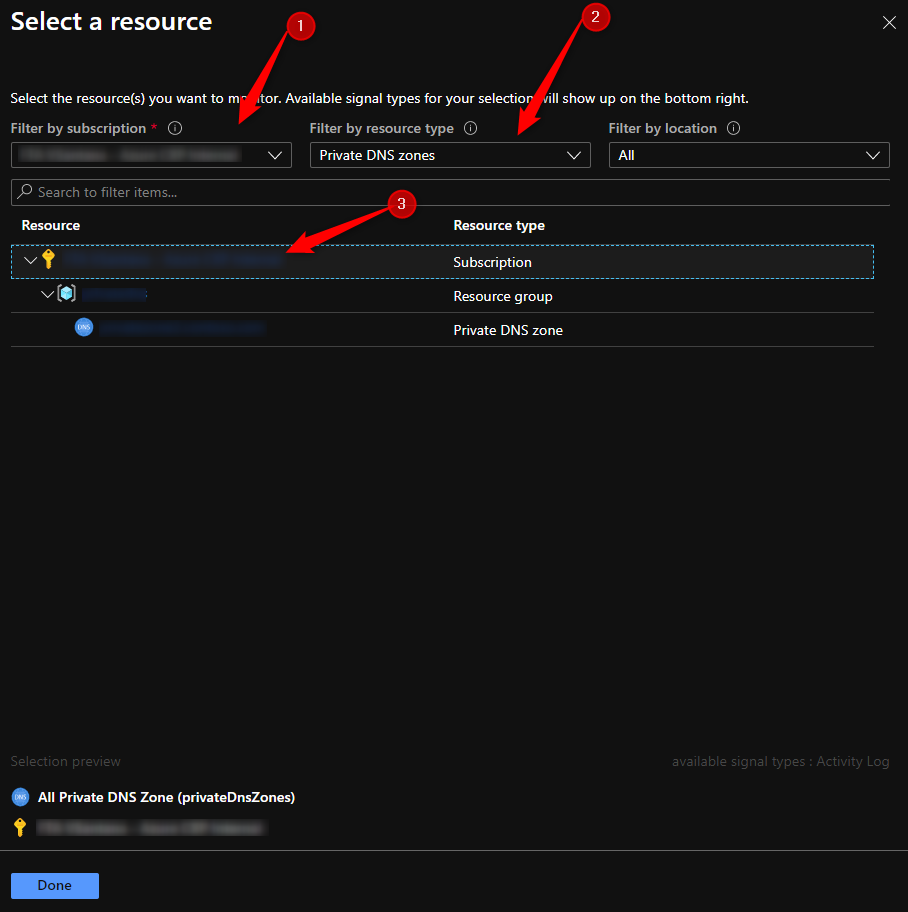

6. Back to **Create alert rule** click **Select condition**

7. In Configure signal logic select the Signal name **Create or Update Private DNS Zone (Microsoft.Network/privateDnsZones)**

    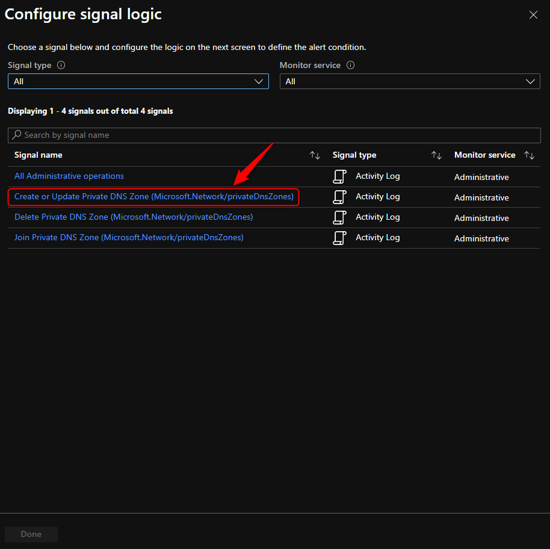

8. Next define the **Alert logic** with the following:
    - **Event Level**: Informational
    - **Status**: Succeeded
    - **Event initiated by**: AzureContainerService

    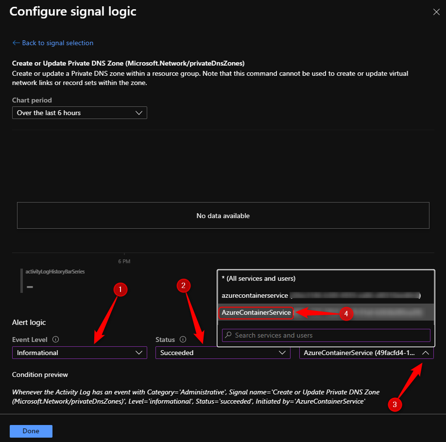

    > Note: The **Event initiated by** you must select the AzureContainerService with the captal latters of each word. It's case sensitive.

9. Back to **Create alert rule** click **Select action group**.

10. Create an action group.

    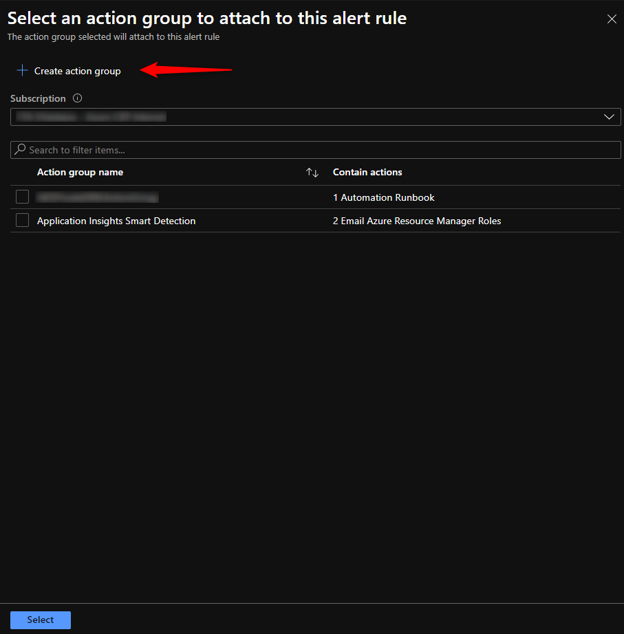

11. Define a **Action group name**, **Short name** and select the resource group where it will be created. Define an **Action name** and select **Action Type** Automation Runbook.

    

12. In **Configure Runbook** select **Runbook source** User, select the subscription where the runbook was created in. Now in **Automation Account** you have to select the **Automation account** [you created](https://github.com/Welasco/AKSDNSPrivateZoneAutoLinkHUBVNet#creating-azure-automation-account). In **Runbook** select the **Runbook** [you created](https://github.com/Welasco/AKSDNSPrivateZoneAutoLinkHUBVNet#create-runbook). Make sure **Enable the common alert schema** is set to No.

    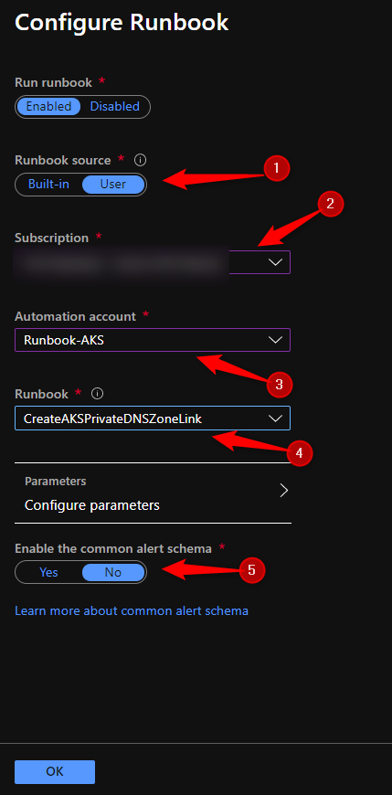

13. Back to **Create alert rule** define a **Alert rule name** and click Create alert rule.

    

